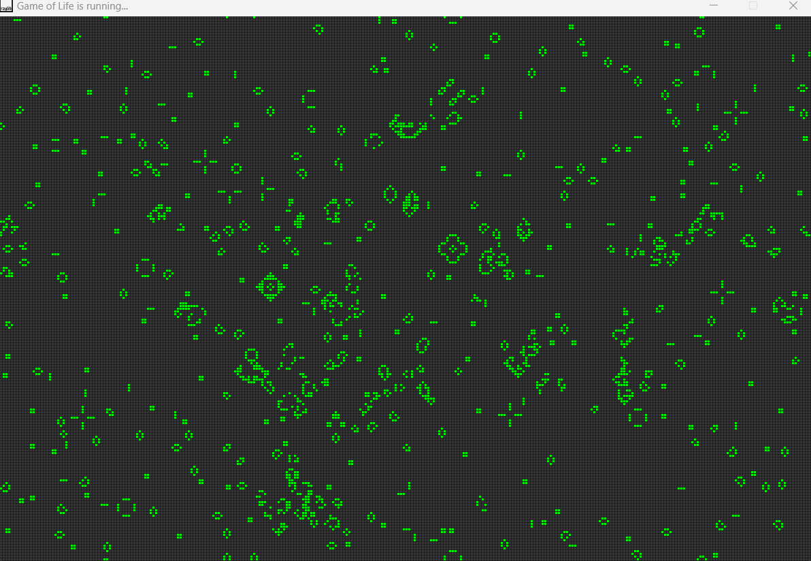

# Game of Life

Conway's game of life, built following this tutorial: 
https://www.youtube.com/watch?v=daFYGrXq0aw&ab_channel=ProgrammingWithNick
 

## Screenshot:  
   

## Game Controls:  
Press 'R' to generate a random state. 
Press 'Enter' to start the generation.  
Press 'Space' to stop the generation.  
Press 'C' to clear the grid.  
Press 'S' to slow down the rate of the spawn.  
Press 'F' to speed up the rate of the spawn.  